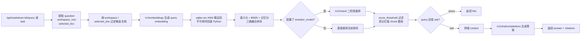

# markdown_kb

本地 Markdown 知识库插件，默认关闭。启用后提供 RAG 检索增强生成能力，支持文档管理、向量索引、多路融合检索、自动注入和 Hook 学习入库。

## sqlite-vec 环境配置

如果希望真正启用 `sqlite-vec` 做第一阶段向量召回（而非 Python 回退），当前 Python 运行时还需满足：内置 `sqlite3` 必须支持 `enable_load_extension()`。

最直接的判断方式是看状态接口返回：

- `vec_available`: 当前运行时是否具备加载 `sqlite-vec` 的基础能力
- `vec_ready`: 当前索引是否已经准备好 vec 虚表
- `vec_enabled`: 当前这份索引是否允许走 vec 粗召回
- `vec_version`: 成功加载时对应的 `sqlite-vec` 版本
- `vector_retrieval_backend`: 第一阶段粗召回实际走的 `sqlite-vec` 还是 Python 回退链路

Apple Silicon macOS 上可用以下命令让 `pyenv 3.12.13` 链接 Homebrew SQLite：

```bash
env \
  PYTHON_CONFIGURE_OPTS='--enable-loadable-sqlite-extensions' \
  LDFLAGS='-L/opt/homebrew/opt/sqlite/lib' \
  CPPFLAGS='-I/opt/homebrew/opt/sqlite/include' \
  PKG_CONFIG_PATH='/opt/homebrew/opt/sqlite/lib/pkgconfig' \
  pyenv install -f 3.12.13

~/.pyenv/versions/3.12.13/bin/python -m pip install sqlite-vec

~/.pyenv/versions/3.12.13/bin/python - <<'PY'
import sqlite3, sqlite_vec
conn = sqlite3.connect(':memory:')
conn.enable_load_extension(True)
sqlite_vec.load(conn)
print(sqlite3.sqlite_version)
print(conn.execute('select vec_version()').fetchone()[0])
PY
```

py2app 打包入口已显式包含 `sqlite_vec`，避免菜单栏应用中因动态导入丢包而退回非 vec 路径。

## 核心能力

- **文档管理**：批量上传/列出/删除 `.md` 文件，支持 workspace 绑定
- **索引**：内置标题树切片器，`sqlite-vec` KNN 粗召回（自动回退 Python），支持全量重建、单文件重建、增量同步
- **检索与问答**：通过本地 AKM 代理的 `/v1/embeddings`、可选 `/v1/rerank`、`/v1/chat/completions` 完成 `query / ask` 闭环
- **自动注入**：启用后自动拦截 `/v1/chat/completions`、`/v1/messages`、`/v1/responses` 三类请求，命中知识库时注入参考资料
- **Hook 学习入库**：通过 Codex/Claude 的 `UserPromptSubmit / Stop / PreCompact` hooks 将会话片段沉淀为 `.learn.md` 知识，自动 workspace 绑定、幂等判重并重建索引；重建文件时自动对新 chunk 做向量相似度去重，相似 chunk 通过 LLM 判断是否有补充信息，有补充时合并文本并重新 embedding，无补充时仅 boost 记忆
- **会话扫描器**：`POST /api/markdown-kb/scan-sessions` 扫描 `~/.codex/sessions/` 和 `~/.claude/projects/*/` 下的 JSONL 会话文件，自动归纳知识并更新记忆
- **记忆系统**：chunk 级 `hit_count` / `memory_value`，艾宾浩斯衰减曲线驱动，多源 boost（learn_new 0.30 / hook_confirm 0.20 / scan_cross 0.20 / retrieval_hit 0.10），高记忆值 chunk（>0.5）可豁免 score_threshold 独立放行；定时自动整理过期记忆并清理无价值 `.learn.md` 文档

## 检索排序策略

第一阶段粗召回采用**三路融合**：`score = vector_score × semantic_weight + keyword_score(BM25) × keyword_weight + memory_score × memory_weight`，三路权重自动归一化。支持分类加权（`category_bonus`）和父标题命中加权（`parent_bonus`）。若有 reranker 则二阶段重排，最终按 `score_threshold` 过滤截断 `top_k`。

## 配置项

`embedding_model`（必填）、`reranker_model`（可选），检索参数：`top_k`（默认 4）、`score_threshold`（0~1，默认 0.7）、`semantic_weight / keyword_weight / memory_weight`。记忆参数：`memory_enabled`、`memory_boost`、`category_bonus`、`organize_interval_hours`。去重参数：`dedup_similarity_threshold`（默认 0.92）。清理参数：`organize_cleanup_enabled`（默认 true）、`organize_cleanup_memory_threshold`（默认 0.05）、`organize_cleanup_keep_days`（默认 7）。

## 显式检索与问答链路



## API 接口

### 文件级工作目录绑定

`POST /api/markdown-kb/files/bind-workspace`：按 `file_name` 为单个 Markdown 文档绑定 `workspace_root`，接口成功返回 `needs_rebuild=true`；绑定关系持久化后需再执行一次 `rebuild-file`、`sync` 或 `rebuild` 才进入索引。

### Hook 学习入库

`POST /api/markdown-kb/learn`：接收 `Codex` 或 `Claude Code` 在 `Stop / PreCompact` 阶段整理出的候选材料，服务端校验 `source / trigger_phase / session_id / dedupe_key`，调用本地 `/v1/chat/completions` 归纳成结构化结果，包装为 `.learn.md` 写入 `docs_dir`。同一个 `dedupe_key` 通过 `~/.akm/markdown_kb/learn_records.json` 幂等判重；若模型判断无稳定知识可沉淀则返回 `ignored=true` 且不写文档。

## CLI Hook 子命令

`akm markdown-kb-hook` 提供三类入口，用于 `Codex` 与 `Claude Code` 共用客户端适配逻辑：

- `prompt-submit`：检测最后一行关键词、剥离关键词行、写入本地 pending 状态，返回净化后的 prompt
- `stop`：读取当前 session 的 pending 状态，发起 `/api/markdown-kb/learn`
- `pre-compact`：仅在 `stop` 未成功处理时补偿调用 `/api/markdown-kb/learn`

接入时 `Codex` 和 `Claude Code` 需各自把事件字段映射到这些 CLI 参数上。仓库附带源码态联调示例：

- `/.codex/hooks.json`
- `/.codex/hooks/*.py`
- `/.claude/settings.local.json`
- `/.claude/hooks/*.py`

这些示例默认指向当前仓库的源码虚拟环境 `/.venv/bin/python`。

## 测试页 Workspace 范围

测试页会基于当前文件列表渲染去重后的 "Workspace 范围" 下拉。默认不选时继续按请求 `workspace_root / working_directory` 检索"公共文档 + 当前工作域文档"；显式选中某个 workspace 时只保留"公共文档 + 该 workspace 文档"。`POST /api/markdown-kb/query` 与 `POST /api/markdown-kb/ask` 也支持从请求体显式接收 `workspace_root / working_directory`。

## 配套 Skill

`skills/markdown-kb-auto-sync/SKILL.md`：将本地 `.md` 文档同步进 `docs_dir`，并在目录更新后调用 `sync` 或 `rebuild` 刷新索引。支持"初始化知识库"工作流：以项目名作为文件名，生成五模块结构（P1 方法论、P2 问题解决方案、P3 概念原理、P4 外部知识精炼、P5 关联映射）的知识文档并写入 `docs_dir`，再执行显式 `sync`。
