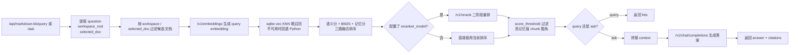

# markdown_kb

本地 Markdown 知识库插件，默认关闭。启用后提供 RAG 检索增强生成能力，支持文档管理、向量索引、多路融合检索、自动注入和 Hook 学习入库。

## sqlite-vec 环境配置

如果希望真正启用 `sqlite-vec` 做第一阶段向量召回（而非 Python 回退），当前 Python 运行时还需满足：内置 `sqlite3` 必须支持 `enable_load_extension()`。

最直接的判断方式是看状态接口返回：

- `vec_available`: 当前运行时是否具备加载 `sqlite-vec` 的基础能力
- `vec_ready`: 当前索引是否已经准备好 vec 虚表
- `vec_enabled`: 当前这份索引是否允许走 vec 粗召回
- `vec_version`: 成功加载时对应的 `sqlite-vec` 版本
- `vector_retrieval_backend`: 第一阶段粗召回实际走的 `sqlite-vec` 还是 Python 回退链路

Apple Silicon macOS 上可用以下命令让 `pyenv 3.12.13` 链接 Homebrew SQLite：

```bash
env \
  PYTHON_CONFIGURE_OPTS='--enable-loadable-sqlite-extensions' \
  LDFLAGS='-L/opt/homebrew/opt/sqlite/lib' \
  CPPFLAGS='-I/opt/homebrew/opt/sqlite/include' \
  PKG_CONFIG_PATH='/opt/homebrew/opt/sqlite/lib/pkgconfig' \
  pyenv install -f 3.12.13

~/.pyenv/versions/3.12.13/bin/python -m pip install sqlite-vec

~/.pyenv/versions/3.12.13/bin/python - <<'PY'
import sqlite3, sqlite_vec
conn = sqlite3.connect(':memory:')
conn.enable_load_extension(True)
sqlite_vec.load(conn)
print(sqlite3.sqlite_version)
print(conn.execute('select vec_version()').fetchone()[0])
PY
```

py2app 打包入口已显式包含 `sqlite_vec`，避免菜单栏应用中因动态导入丢包而退回非 vec 路径。

## 核心能力

- **文档管理**：批量上传/列出/删除 `.md` 文件，支持 workspace 绑定
- **索引**：内置标题树切片器，`sqlite-vec` KNN 粗召回（自动回退 Python），支持全量重建、单文件重建、增量同步
- **检索与问答**：通过本地 AKM 代理的 `/v1/embeddings`、可选 `/v1/rerank`、`/v1/chat/completions` 完成 `query / ask` 闭环
- **自动注入**：默认关闭（插件配置 `auto_inject`），开启后自动拦截 `/v1/chat/completions`、`/v1/messages`、`/v1/responses` 三类请求，命中知识库时注入参考资料
- **项目级 context/memory 自动维护**：默认关闭（插件配置 `inject_project_context`），为每个绑定过工作区的项目在插件数据目录下自动维护 `context.md` / `memory.md`，开启后在带工作区信号的首轮请求里注入项目上下文 + 最近修改记忆，后续轮次仅在记忆版本更新时轻量刷新；两个注入开关正交互不影响。context.md 由本地模型“首次生成 / 最小化增量更新”维护（只依据一次性读取的真实仓库材料，≤150 行、固定章节、1 天冷却），memory.md 由 KB 事件确定性渲染
- **Hook 学习入库**：通过 Codex/Claude 的 `UserPromptSubmit / Stop / PreCompact` hooks 将会话片段沉淀为 `.learn.md` 知识，自动 workspace 绑定、幂等判重并重建索引；重建文件时自动对新 chunk 做向量相似度比对，相似 chunk 仍保留新文档内容，并通过 LLM 判断是否有补充信息，有补充时合并存量文本并重新 embedding，同时 boost 存量记忆
- **会话扫描器**：`POST /api/markdown-kb/scan-sessions` 扫描 `~/.codex/sessions/` 和 `~/.claude/projects/*/` 下的 JSONL 会话文件，自动归纳知识并更新记忆
- **记忆系统**：chunk 级 `hit_count` / `memory_value`，艾宾浩斯衰减曲线驱动，多源 boost（learn_new 0.30 / hook_confirm 0.20 / scan_cross 0.20 / retrieval_hit 0.10），高记忆值 chunk（>0.5）可豁免 score_threshold 独立放行；定时自动整理过期记忆并清理无价值 `.learn.md` 文档

## 检索排序策略

第一阶段粗召回采用**三路融合**：`score = vector_score × semantic_weight + keyword_score(BM25) × keyword_weight + memory_score × memory_weight`，三路权重自动归一化。支持分类加权（`category_bonus`）和父标题命中加权（`parent_bonus`）。若有 reranker 则二阶段重排，最终按 `score_threshold` 过滤截断 `top_k`。

## 配置项

> 以下为管理台「插件」页可配置的全部配置项（存储于 `~/.akm/config.json` 的 `plugin_configs.markdown_kb`），默认值与插件 `plugin.json` 声明一致。其余记忆系统参数（`memory_boost`、`category_bonus`、`organize_interval_hours` 等）为代码级默认，当前不在管理台暴露。

| 配置项 | 类型 | 默认值 | 说明 |
|--------|------|--------|------|
| `embedding_model` | select | `text-embedding-3-small` | 必填。重建索引和检索时调用 AKM `/v1/embeddings` 使用的模型名。 |
| `reranker_model` | select | `""` | 可选。为空时只使用向量召回；非空时会在向量召回结果上追加一次 AKM `/v1/rerank` 重排。 |
| `chat_model` | select | `""` | 执行 ask 问答时调用 AKM `/v1/chat/completions` 使用的模型名。 |
| `auto_inject` | boolean | `False` | 默认关闭。开启后，对 chat / messages / responses 三类文本请求自动抽取最后一个用户问题检索知识库并注入参考资料；关闭时可使用管理台 query / ask 或 `/api/markdown-kb/query`、ask 手动使用。 |
| `inject_project_context` | boolean | `False` | 默认关闭。开启后，对带工作区信号（`workspace_root` / `working_directory` / `project_id`）的三类文本请求：会话首轮注入该工作区的 `context.md` + `memory.md`，后续轮次仅在记忆版本更新时轻量刷新。与 `auto_inject` 正交：不改变既有 RAG 自动注入行为。 |
| `chunk_size` | number | `800` | 单个 chunk 的目标最大字符数。 |
| `chunk_overlap` | number | `120` | 相邻 chunk 之间保留的重叠字符数。 |
| `top_k` | number | `4` | query / ask 在未显式传 top_k 时默认返回的片段数量。启用 rerank 后也仍然生效，但只控制最终保留条数。 |
| `semantic_weight` | number | `1` | 仅在未启用 rerank 时生效。用于控制向量语义分在第一阶段排序中的占比；会和关键词权重按比例归一化。 |
| `keyword_weight` | number | `0` | 仅在未启用 rerank 时生效。用于补强标题词、英文术语或精确短语匹配。 |
| `score_threshold` | number | `0.7` | 0~1。最终命中分低于该阈值时直接过滤；未启用 rerank 时使用混合分，启用 rerank 后使用 rerank 分。 |
| `memory_enabled` | boolean | `False` | 默认关闭。开启后自动跟踪 chunk 记忆值（检索命中 / learn / scan 时自动更新记忆，记忆值按艾宾浩斯曲线衰减并影响检索排序）。 |
| `auto_organize_enabled` | boolean | `False` | 默认关闭。开启后，每次检索时按消息计数（`organize_message_threshold`，默认 50）或定时周期（`organize_interval_hours`，默认 24 小时）异步触发自动整理：扫描最近会话、生成知识、更新记忆，并清理过期记忆与无价值 learn 文档。 |
| `organize_cleanup_enabled` | boolean | `False` | 默认关闭。开启后，长时间未被检索的 learn 文档会在自动整理时被清理。 |
| `organize_cleanup_memory_threshold` | number | `0.05` | 记忆值低于此阈值且从未被检索命中的 chunk 所属文档可能被视为无价值。 |
| `organize_cleanup_keep_days` | number | `7` | 从未被检索命中的 learn 文档至少保活的天数。 |
| `dedup_similarity_threshold` | number | `0.92` | 新 chunk 与存量 chunk 的向量余弦相似度超过此阈值时视为重复，保留新 chunk 以维持文档完整，并 boost 已有 chunk 的记忆值。 |
| `learn_summary_system_prompt` | text | 知识提炼提示词 | learn 知识提炼时发给 chat 模型的 system prompt，控制知识归纳的质量和格式。 |
| `merge_chunks_system_prompt` | text | 知识合并提示词 | 去重合并时发给 chat 模型的 system prompt。 |
| `merge_chunks_user_prompt` | text | 合并模板 | 去重合并时发给 chat 模型的 user prompt。占位符 `{old_text}` 替换为已有 chunk 文本，`{new_text}` 替换为新 chunk 文本。 |

### 初始化 / 回填

老数据升级场景：旧版本的知识库已有文档绑定但没有项目记忆文件。插件加载时若开启 `inject_project_context`，会在后台从 manifest / 文件绑定 / learn 记录里收敛全部工作区并批量补齐 `context.md` / `memory.md`（回填只建骨架，context 的 LLM 首次生成由各工作区异步补齐）；也可以随时手动触发 `POST /api/markdown-kb/projects/init`。

## 项目级 context.md / memory.md 自动维护

每个绑定过文档的工作区（workspace_root）对应一份“项目记忆”，文件存在插件数据根下、**不进** docs 清单/索引、不参与检索与记忆分：

```text
~/.akm/markdown_kb/projects/<project_id(sha1)>/
├── context.md    # 项目上下文：先由本地材料生成骨架，再由 LLM“首次生成”升级为固定章节说明书；后续按 1 天冷却做最小化增量更新；人工编辑内容不覆盖
├── memory.md     # 最近修改记忆（热记忆）：由 meta 事件表 + digest 文本确定性重渲染，每次维护后刷新
└── meta.json     # 机器侧唯一事实源：事件表 / pending / revision / digest_text / context_source / 时间戳
```

- **触发源只收“知识库内容变化”事件**：文档新增/覆盖（upload / write / sync / rebuild-file / learn / scan 落盘均记录）、删除；不监听项目目录 fs，不依赖 git
- **两级维护**：文件级事件零成本同步追加（`meta.json` 事件表 + 重渲染 `memory.md`）；语义摘要（digest）攒批 + 冷却后调用一次本地 chat 把事件折叠成“近期要点”（事件达标 `≥3` 立即触发，否则距上次 digest 超 5 分钟触发；模型为空 / 调用失败自动降级为纯文本摘要，不 crash）
- **context.md 语义生成**：首次生成时，模型只依据触发时刻一次性读取的真实材料（两级目录树 + AGENTS/README/package.json 等固定文件原文 + 知识库关联文档）重组成 ≤150 行、7 个固定章节的项目说明书，禁止临期词与脑补目录；之后按 1 天冷却做“最小化增量更新”（只改过时条目，输出与现状一致不落盘）；无模型 / 调用失败保留现状并标记 degraded；人工自建（无自动维护标记）的 context 绝不覆盖，context 变化不影响 memory 的 revision
- **注入策略**：开启 `inject_project_context` 后，命中工作区的会话**首轮**注入全量（项目上下文 + 最近修改记忆），后续轮次仅当记忆 `revision` 更新时注入轻量“记忆更新”段；项目注入与 RAG 注入同时命中时合并为一段，只注入一次
- **信号抽取严格化（v0.1.4）**：工作区信号只从会话开头 3 条消息内识别——opencode 取完整 `<env>...</env>` 块里成行的 `Working directory:`，Claude 取 system / 早期消息文本里的 `Primary working directory`；对话正文（含被客户端整段重发的历史消息）中出现的同类字样不再触发。抽取值先做路径清洗（只收绝对路径，拒绝夹带 `<`、`>`、反引号、全角括号、省略号、引号等对话残片的取值），清洗为空则不命中；命中后若目录不存在或已删除，跳过自动建项目与后台刷新（不产生垃圾项目、不烧 token）；后台自动刷新任务在 KB 材料为空时直接跳过，避免生成“全缺失”占位文档
- **降级与容错**：项目目录写满 500 个、模型不可用、manifest 读取失败等均不影响主 RAG 链路

相关接口：

- `GET /api/markdown-kb/projects`：项目记忆列表（工作区 / revision / pending / 是否有 digest / context 状态）
- `GET /api/markdown-kb/project-context?workspace_root=...`：读取单个项目的 context.md / memory.md / 事件表
- `POST /api/markdown-kb/projects/init`：初始化 / 回填（老项目补齐两个文件，幂等；可选传 `workspace_roots` 限定）
- `POST /api/markdown-kb/projects/maintain`：手动触发一次 digest
- `POST /api/markdown-kb/projects/context`：手动触发单个工作区 context 首次生成 / 增量更新（body：`workspace_root`，可选 `force`）

## 显式检索与问答链路


```mermaid
flowchart LR
    A["/api/markdown-kb/query 或 /ask"] --> B["提取 question<br/>workspace_root<br/>selected_doc"]
    B --> C["按 workspace / selected_doc 过滤候选文档"]
    C --> D["/v1/embeddings 生成 query embedding"]
    D --> E["sqlite-vec KNN 粗召回<br/>不可用时回退 Python"]
    E --> F["语义分 + BM25 + 记忆分<br/>三路融合排序"]
    F --> G{"配置了 reranker_model?"}
    G -->|是| H["/v1/rerank 二阶段重排"]
    G -->|否| I["直接使用当前排序"]
    H --> J["score_threshold 过滤<br/>高记忆值 chunk 豁免"]
    I --> J
    J --> K{"query 还是 ask?"}
    K -->|query| L["返回 hits"]
    K -->|ask| M["拼接 context"]
    M --> N["/v1/chat/completions 生成答案"]
    N --> O["返回 answer + citations"]
```

## API 接口

### 文件级工作目录绑定

`POST /api/markdown-kb/files/bind-workspace`：按 `file_name` 为单个 Markdown 文档绑定 `workspace_root`，接口成功返回 `needs_rebuild=true`；绑定关系持久化后需再执行一次 `rebuild-file`、`sync` 或 `rebuild` 才进入索引。

### 全文读取与文本写入

`GET /api/markdown-kb/files/{name}`：按文件名读取单个文档全文，返回 `ok / doc_id / file_name / workspace_root / content / size_bytes`（`content` 为 UTF-8 全文）。供「读→改→重建」闭环的读取端使用：先取全文编辑，再写回重建。

`POST /api/markdown-kb/files/write`：按 JSON 文本写入 / 覆盖文档，请求体为 `{"file_name": "...", "content": "...", "workspace_root": "..."}`。复用 `files/upload` 的落盘语义（路径安全校验 + manifest 维护，同名覆盖）。**只落盘、不建索引**，写入后需另行 `POST /api/markdown-kb/rebuild-file` 或 `/rebuild` 重建索引。

### Hook 学习入库

`POST /api/markdown-kb/learn`：接收 `Codex` 或 `Claude Code` 在 `Stop / PreCompact` 阶段整理出的候选材料，服务端校验 `source / trigger_phase / session_id / dedupe_key`，调用本地 `/v1/chat/completions` 归纳成结构化结果，包装为 `.learn.md` 写入 `docs_dir`。同一个 `dedupe_key` 通过 `~/.akm/markdown_kb/learn_records.json` 幂等判重；若模型判断无稳定知识可沉淀则返回 `ignored=true` 且不写文档。

## MCP（HTTP）接入

本插件的检索接口以 **MCP streamable HTTP** 方式暴露，端点地址为 `http://127.0.0.1:{port}/api/markdown-kb/mcp`（`{port}` 为配置项 `server_port`，默认 `8800`）。支持 `tools/list` 与 `tools/call`，无需额外安装依赖。

在支持 HTTP MCP 的客户端（如 Claude Desktop、Cursor）中按以下格式配置：

```json
{
  "type": "http",
  "url": "http://127.0.0.1:8800/api/markdown-kb/mcp"
}
```

暴露的工具：

| 工具 | 参数 | 说明 |
|------|------|------|
| `search_kb` | `question`（必填）、`top_k`（1-20，默认 5）、`embedding_model`、`reranker_model`、`workspace_root`（可选） | 调用 `POST /api/markdown-kb/query` 做语义检索，返回命中文档片段列表（标题、文件名、相关度分数、内容片段）。未传 `workspace_root` 时检索全部文档 |
| `ask_kb` | `question`（必填）、`chat_model`、`workspace_root`（可选） | 调用 `POST /api/markdown-kb/ask` 做问答，返回答案与引用来源列表。未传 `workspace_root` 时基于全部文档作答 |

### 文档维护工具

| 工具 | 参数 | 说明 |
|------|------|------|
| `list_kb_files` | `workspace_root`（可选） | 调用 `GET /api/markdown-kb/files`，列出已入库文档。传 `workspace_root` 时只返回绑定到该目录的文档 |
| `read_kb_file` | `file_name`（必填）、`workspace_root`、`doc_id` | 调用 `GET /api/markdown-kb/files/{name}`，读取单个文档全文，便于「读→改→重建」闭环的读取端 |
| `write_kb_file` | `file_name`（必填）、`content`（必填）、`workspace_root` | 调用 `POST /api/markdown-kb/files/write`，按 JSON 文本写入 / 覆盖文档（复用 upload 落盘语义，写入后需 `rebuild_kb` / `rebuild_kb_file` 重建索引才可被检索） |
| `kb_status` | — | 调用 `GET /api/markdown-kb/status`，查看索引与 vec 状态 |
| `bind_kb_workspace` | `file_name`（必填）、`workspace_root`（必填）、`doc_id` | 调用 `POST /api/markdown-kb/files/bind-workspace`，为文档绑定工作目录 |
| `delete_kb_file` | `file_name`（必填）、`workspace_root`、`doc_id` | 调用 `POST /api/markdown-kb/files/delete`，删除文档 |
| `rebuild_kb` | — | 调用 `POST /api/markdown-kb/rebuild`，全量重建索引 |
| `rebuild_kb_file` | `file_name`（必填）、`workspace_root`、`doc_id` | 调用 `POST /api/markdown-kb/rebuild-file`，重建单个文档索引 |
| `clear_kb` | `delete_docs`（bool，默认 true） | 调用 `POST /api/markdown-kb/clear`，清空索引（可同时删除文档） |
| `sync_kb` | `apply`（bool） | 调用 `POST /api/markdown-kb/sync`，按 docs 目录做增量同步 |
| `learn_kb` | `source`（必填）、`trigger_phase`（必填）、`session_id`（必填）、`dedupe_key`（必填）、`workspace_root`、`title_hint`、`user_prompt`、`assistant_excerpt`、`conversation_excerpt`、`learn_keyword`、`turn_id` | 调用 `POST /api/markdown-kb/learn`，把一次协作会话提炼为知识入库 |
| `scan_kb_sessions` | `since_hours`（默认 24）、`max_sessions`（默认 5）、`learn_enabled`（默认 true）、`memory_enabled`（默认 true） | 调用 `POST /api/markdown-kb/scan-sessions`，扫描 Codex/Claude 会话文件并归纳知识 |
| `list_kb_projects` | — | 调用 `GET /api/markdown-kb/projects`，列出全部项目级 context/memory（含 context 状态与记忆版本） |
| `read_kb_project_context` | `workspace_root`（必填） | 调用 `GET /api/markdown-kb/project-context`，读取单工作区的 context.md / memory.md 全文 |
| `init_kb_projects` | `workspace_roots`（可选） | 调用 `POST /api/markdown-kb/projects/init`，批量初始化 / 回填项目记忆（老项目升级后用） |
| `maintain_kb_projects` | `workspace_root`（必填） | 调用 `POST /api/markdown-kb/projects/maintain`，手动触发一次 digest |
| `refresh_kb_project_context` | `workspace_root`（必填）、`force`（bool） | 调用 `POST /api/markdown-kb/projects/context`，重生成单工作区 context.md（首次生成 / 按 1 天冷却增量更新） |

> `{port}` 端口的服务必须是正在运行的 AKM 实例（管理台 / 服务）。请求会经本机 HTTP 转发到插件真实路由。

## CLI Hook 子命令

`akm markdown-kb-hook` 提供三类入口，用于 `Codex` 与 `Claude Code` 共用客户端适配逻辑：

- `prompt-submit`：检测最后一行关键词、剥离关键词行、写入本地 pending 状态，返回净化后的 prompt
- `stop`：读取当前 session 的 pending 状态，发起 `/api/markdown-kb/learn`
- `pre-compact`：仅在 `stop` 未成功处理时补偿调用 `/api/markdown-kb/learn`

接入时 `Codex` 和 `Claude Code` 需各自把事件字段映射到这些 CLI 参数上。仓库附带源码态联调示例：

- `/.codex/hooks.json`
- `/.codex/hooks/*.py`
- `/.claude/settings.local.json`
- `/.claude/hooks/*.py`

这些示例默认指向当前仓库的源码虚拟环境 `/.venv/bin/python`。

## 测试页 Workspace 范围

测试页会基于当前文件列表渲染去重后的 "Workspace 范围" 下拉。默认不选时继续按请求 `workspace_root / working_directory` 检索"公共文档 + 当前工作域文档"；显式选中某个 workspace 时只保留"公共文档 + 该 workspace 文档"。`POST /api/markdown-kb/query` 与 `POST /api/markdown-kb/ask` 也支持从请求体显式接收 `workspace_root / working_directory`。知识库本身已有文档、但当前工作区范围没有任何文档时，`query` 返回 HTTP 200 与空 `hits`，表示查询有效但没有可用资料；只有知识库整体为空或请求参数无效时才返回错误。

## 配套 Skill

`skills/markdown-kb-auto-sync/SKILL.md`：将本地 `.md` 文档同步进 `docs_dir`，并在目录更新后调用 `sync` 或 `rebuild` 刷新索引。支持"初始化知识库"工作流：以项目名作为文件名，生成五模块结构（P1 方法论、P2 问题解决方案、P3 概念原理、P4 外部知识精炼、P5 关联映射）的知识文档并写入 `docs_dir`，再执行显式 `sync`。
